### Clarity: Equality

```js [1-7]
      123 == 123        // primitive
    "abc" == "ab" + "c" // string
      [1] == [1]        // collection
Data(123) == Data(123)  // object
```

#### Notes

1. It depends on the context, and it's not even the same across languages.

<!-- --- -->

### Clarity: Equality

<div class="two_col_container">

<div class="col">

Whether `==` means value or referential equality depends on:

1. 🔢 Primitive / 📃 Non-primitive
2. 📝 Single / 📂 Collection
3. 🗣️ Language

</div>

<div class="col" style="flex-basis: 2.0;"></div>

<span style="display: none;">[source](https://azriel.im/dot_ix/#src=OYJwhgDgFg+gzgFwJ4BsCmAuABAIwPYAeAUACYCWIaAxgmXgHbYBuaItVYKRUZrYIVKEgxEsWRPwTYA3gF9RWCCDIBbMrRYwmnAK5oYaAI4z5YvDgBW1KVjkKjMEmgBmZemhImFAdyhgEMChg9MBeZpYwlM6saPS0nAaGOpzqwramWOYWWrr6RmFYQSEwFmDaiQUAxIXBwCVwFekKRXUQSI12RPR4TjD0YCpocCJiEmzYAEQACspqGmiZIFgA8pbWAPwTCkqq6mSa2ih6jQBkh8dGWBMAarkAPDggAPQAfEbJKKlb4VY0kwDKbmA6EWD2eLwAwngUOgaHR6Jt7IZHC43B5JgADd6cOAACgAlFgnlgALwkjFYJyudwkRE-SIuGJxMgJbGfZDYE5RRJXABKjMozM4YNebK+CiyOSOeWMWAAVOcZT4-AEWpMADK1ZLANB0mrFUrlfLy7lGZq1eqNOWmwzm4ptK2KxJEIgeHXDBRjAIwHZzfb6J3GgDaXoANIpZnsDrlEgBdT0ISQwGBZazYEOJtjh1M0eM-azJhxUtGeLBBnMIcNF1E0vOZNY0ZO+fyBWrpivh5uq2p16vUjzJyVRJnxFCJD6pdN9kvZiLDwWj8cpZC95HFmmDiKB2VB6c02fZbd1rut4qnuqGsCNIMnlrhlolMpXox16q3i3ny3B98he8WiwNC+yotg+n4Ot+Krnn+9rtEBrokDqKJwFQHqjJm3q+lGAYxsaExiJh8xiFcCZJimDY2Hh+Y0N89a-N6e7olcoxAiCRE0RWTaQWqTFYFQ0KwrQDA0QxJCbtk86xIuYoclcgCoZAAUk+WAAJpDE8AByeBYCKLyALwbgCwO1MSAIFADChjpgB8G4A+XsQtUmnCWuNYDmRh44bKlEGUZJlmZZNnVKpcA0T+dSfpejSUQpSnaY8ryADwbgAI+-J-xPAAKv8QVcR+D4AeFYgJVgSWpf8xFiMFyYPuB7liJ5xmmfQOm6YAcTu8joOBIGIWxEKAkBQEwZAAF4wP4CAgKhWBuvoaj0Og9Aos4YA6CgNgAEwuiZaCDCM4jIOgY1iIM5A6ConIHWQR0KERWCuDC8B+L03QgConDYAA5MtAAM70vRdRHXWOcB3fopksCAr0AIyfd9l1iH9t1gL0zh4FQOjDFgb2Qz9MNkDdAPw-oYBwiwr0fV9mPbSAeAANb6Lj914I9z1owA7Bj0Pk1TNOAzAwOsK9ABsrPQ4gFPU3DCNIyjr0s6TbPCxzYv44TmBowAHBjP2fMAUA2Ccmva2TsO0-oD1PSg4OC5dhtczzoNowArDL0NW3jMCI8jqMvRDjuW9j-1cwT8zm97RFy6LRt9PTpuvQALBbIcjfL4c269ADMcdoSLnMu27kto7HwcZ4n-tK69DsF1g1ShzTO3KyQeAIAgHgupd3S9FSC1LajcqnedP2HIk8A16jZyssiiCoEMZO4xA+h8Sg9PYKAaCxD9BH+lKFyygqo+DxPcA-ZK27YNvY4OOPu0axalXH-3Z9D83RE2rvu2ck-5+T7LfgzzAc8L7g0oHznAKSSLJT5JGXGka0LgB7v33pdbKT4rRv3vvA-8gEt7IL3kQIAA)</span>

</div>

#### Notes

1. A lot of you have this flow chart in your head.

<!-- --- -->

### Clarity: Equality

| Language               | ☕<br/>Java | 🌐 JS | 🐍 Python | 🦀 Rust |
|------------------------|-----------|-------|-----------|----------|
| 123 == 123             |     🟢    |   🟢  |     🟢    |    🟢   |
| "abc" == "ab" + "c"    | sometimes |   🟢  |     🟢    |    🟢   |
| [1] == [1]             |     🔴    |   🔴  |     🟢    |    🟢   |
| Data(123) == Data(123) |     🔴    |   🔴  |     🔴    |    |


<!-- --- -->

### Clarity: Outcomes

```rust ignore [1-10]
// Definition
fn download(/* .. */) -> Outcome { /* .. */ }

pub enum Outcome {
    Success { n_bytes: u64 },                   // Downloaded successfully
    Cached,                                     // Previously downloaded
    DnsLookupFailed { host: Host             }, // Couldn't find the server
    ConnectFailed   { host: Host, ip: IpAddr }, // Couldn't connect to the server
    ConnectionBroke { host: Host, n_bytes: u64 }, // Connection broke while downloading
}
```

#### Notes

1. Let's say we're writing a download function, which can finish in different ways.
2. In each way this function could finish, it passes back information associated with each outcome.
3. This is really nice to write, because you can accurately model every outcome:
4. You're not having an arbitrary "data" field that needs to be downcasted.
5. You're not having a common set of fields, some of which are `null` depending on the outcome.

4. It is of course completely possible to introduce a `Result` type in any other language.
5. The

<!-- --- -->

### Clarity: Outcomes

```rust ignore [1-11]
// Usage
let outcome = download(/* .. */);

match outcome {
    Outcome::Success { .. }               => { /* .. */ }
    Outcome::Cached                       => { /* .. */ }
    Outcome::DnsLookupFailed { host     } => { /* Tell user: URL may be incorrect */ }
    Outcome::ConnectFailed   { host, ip } => { /* Tell user: Check service status */ }
    Outcome::ConnectionBroke { host, n_bytes } => { /* Retry: may be intermittent */ }
}
```

#### Notes

1. On the usage side, it's really nice to know every code path that needs to be handled,
2. *and* have the data associated with that code path without needing to downcast or null check.
3. If you miss any outcome variant, the compiler tells you *which one*.


---

### Clarity: Errors

```rust ignore [1-10]
// like public void download() throws Error {}
fn download() -> Result<(), Error> {}

pub enum Error {
    DnsLookupFail { host: Host             },   // Couldn't find the server
    ConnFail      { host: Host, ip: IpAddr },   // Couldn't connect to the server
    ConnBroke     { host: Host, n_bytes: u64 }, // Connection broke while downloading
}
```

#### Notes

1. In Rust, by convention, functions that can fail return a `Result`.
2.

4. It is of course completely possible to introduce a `Result` type in any other language.
5. The

<!-- --- -->

### Clarity: Errors

```rust ignore [1-11]
// If `download` returns an error, keep going, otherwise return.
let Err(error) = download() else { return Ok(()); };

match error {
    Error::DnsLookupFail { host     }      => { /* Tell user: URL may be incorrect */ }
    Error::ConnFail      { host, ip }      => { /* Tell user: Check service status */ }
    Error::ConnBroke     { host, n_bytes } => { /* Retry: may be intermittent */ }
}
```

#### Notes

1. On the usage side, it's really nice to know every code path that needs to be handled,
2. *and* have the data associated with that code path without needing to downcast or null check.
3. If you miss any outcome variant, the compiler tells you *which one*.


---

### Clarity: Errors

```rust ignore [1-10]
// like `public Outcome download() throws Error {}`
fn download() -> Result<Outcome, Error> {}

pub enum Error {
    Success { n_bytes: u64 }, // Downloaded successfully
    Cached,                   // Previously downloaded
}

pub enum Error {
    DnsLookupFail { host: Host             },   // Couldn't find the server
    ConnFail      { host: Host, ip: IpAddr },   // Couldn't connect to the server
    ConnBroke     { host: Host, n_bytes: u64 }, // Connection broke while downloading
}
```

#### Notes

1. In Rust, by convention, functions that can fail return a `Result`.
2. Because there's no such thing as `null`, there's no temptation to

4. It is of course completely possible to introduce a `Result` type in any other language.
5. The

<!-- --- -->

### Clarity: Errors

```rust ignore [1-11]
let result = download();

match result {
    Ok(Outcome::Success      { n_bytes })       => { /* .. */ }
    Ok(Outcome::Cached)                         => { /* .. */ }
    Err(Error::DnsLookupFail { host     })      => { /* Tell user: URL may be incorrect */ }
    Err(Error::ConnFail      { host, ip })      => { /* Tell user: Check service status */ }
    Err(Error::ConnBroke     { host, n_bytes }) => { /* Retry: may be intermittent */ }
}
```


---

## Clarity: Errors

<!-- --- -->

### Clarity: Errors (context)

Failure values in different contexts:

1. 🔏 boolean: 0 means `false`, 1 means `true`.

2. 💻 exit code: 1 means failure, 0 means success.

3. 🔢 function A: `-1` means failure.

4. 🌐 function B: `null` means failure.

5. 🦫 function C: `null` means success.


#### Notes

1. Common sources of ambiguity in code is when:
2. a "normal" value is treated specially, and
3. a special value is used to mean many things.
4. The worse thing is when you're tracing a bug that calls function A, B, C, which calls a process.

<!-- --- -->

### Clarity: Errors

```rust ignore [1-6]
// From the standard library
impl Command {
    /// Executes a command as a child process, waiting for it to finish
    /// and collecting its status.
    pub fn status(&mut self) -> Result<ExitStatus, Error> { /* .. */ }
}
```

#### Notes

1. In Rust, very early on you are taught that functions that can fail should return a `Result`.
2. It's like having checked exceptions, with much less overhead to define the errors.
3. Because there's no such thing as `null`, it's never used as a return value.


---

<!-- --- -->

### Clarity: Equality

What `==` means


<span style="display: none;">[source](https://azriel.im/dot_ix/#src=OYJwhgDgFg+gzgFwJ4BsCmAuABAIwPYAeAUACYCWIaAxgmXgHbYBuaItVYKRUZrYIVKEgxEsWRPwTYA3gF9RWCCDIBbMrRYwmnAK5oYaAI4z5YvDgBW1KVjkKjMEmgBmZemhImFAdyhgEMChg9MBeZpYwlM6saPS0nAaGOpzqwramWOYWWrr6RmFYQSEwFmDaiQUAxIXBwCVwFekKRXUQSI12RPR4TjD0YCpocCJiEmzYAEQACspqGmiZIFgA8pbWAPwTCkqq6mSa2ih6jQBkh8dGWBMAarkAPDggAPQAfEbJKKlb4VY0kwDKbmA6EWD2eLwAwngUOgaHR6Jt7IZHC43B5JgADd6cOAACgAlFgnlgALwkjFYJyudwkRE-SIuGJxMgJbGfZDYE5RRJXABKjMozM4YNebK+CiyOSOeWMWAAVOcZT4-AEWpMADK1ZLANB0mrFUrlfLy7lGZq1eqNOWmwzm4ptK2KxJEIgeHXDBRjAIwHZzfb6J3GgDaXoANIpZnsDrlEgBdT0ISQwGBZazYEOJtjh1M0eM-azJhxUtGeLBBnMIcNF1E0vOZNY0ZO+fyBWrpivh5uq2p16vUjzJyVRJnxFCJD6pdN9kvZiLDwWj8cpZC95HFmmDiKB2VB6c02fZbd1rut4qnuqGsCNIMnlrhlolMpXox16q3i3ny3B98he8WiwNC+yotg+n4Ot+Krnn+9rtEBrokDqKJwFQHqjJm3q+lGAYxsaExiJh8xiFcCZJimDY2Hh+Y0N89a-N6e7olcoxAiCRE0RWTaQWqTFYFQ0KwrQDA0QxJCbtk86xIuYoclcgCoZAAUk+WAAJpDE8AByeBYCKLyALwbgCwO1MSAIFADChjpgB8G4A+XsQtUmnCWuNYDmRh44bKlEGUZJlmZZNnVKpcA0T+dSfpejSUQpSnaY8ryADwbgAI+-J-xPAAKv8QVcR+D4AeFYgJVgSWpf8xFiMFyYPuB7liJ5xmmfQOm6YAcTu8joOBIGIWxEKAkBQEwZAAF4wP4CAgKhWBuvoaj0Og9Aos4YA6CgNgAEwuiZaCDCM4jIOgY1iIM5A6ConIHWQR0KERWCuDC8B+L03QgConDYAA5MtAAM70vRdRHXWOcB3fopksCAr0AIyfd9l1iH9t1gL0zh4FQOjDFgb2Qz9MNkDdAPw-oYBwiwr0fV9mPbSAeAANb6Lj914I9z1owA7Bj0Pk1TNOAzAwOsK9ABsrPQ4gFPU3DCNIyjr0s6TbPCxzYv44TmBowAHBjP2fMAUA2Ccmva2TsO0-oD1PSg4OC5dhtczzoNowArDL0NW3jMCI8jqMvRDjuW9j-1cwT8zm97RFy6LRt9PTpuvQALBbIcjfL4c269ADMcdoSLnMu27kto7HwcZ4n-tK69DsF1g1ShzTO3KyQeAIAgHgupd3S9FSC1LajcqnedP2HIk8A16jZyssiiCoEMZO4xA+h8Sg9PYKAaCxD9BH+lKFyygqo+DxPcA-ZK27YNvY4OOPu0axalXH-3Z9D83RE2rvu2ck-5+T7LfgzzAc8L7g0oHznAKSSLJT5JGXGka0LgB7v33pdbKT4rRv3vvA-8gEt7IL3kQIAA)</span>

#### Notes

1. A lot of you have this flow chart in your head.

---

## Clarity: Errors

<!-- --- -->

### Clarity: Errors &ndash; Sentinel values

| type              | ❌ error        | ✅ success     |
| ----------------- | -------------- | -------------- |
| 🔏 boolean        | false          | true           |
| 🔢 int            | -1             | >= 0           |
| 📂 success object | null           | value returned |
| 📂 error object   | value returned | null           |


#### Notes

1. Errors. Errors are represented in different ways, and it changes from library to library.
2. With sentinel values, which is using a value within the type, to mean "error",
3. then the caller has to remember to check for the error value, then diverge the code paths for success and failure.

<!-- --- -->
