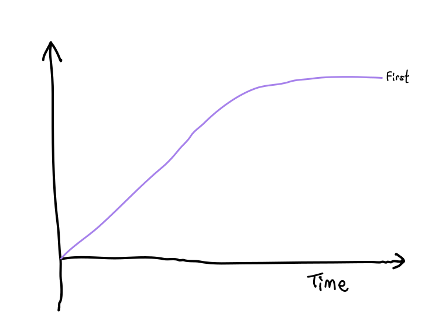
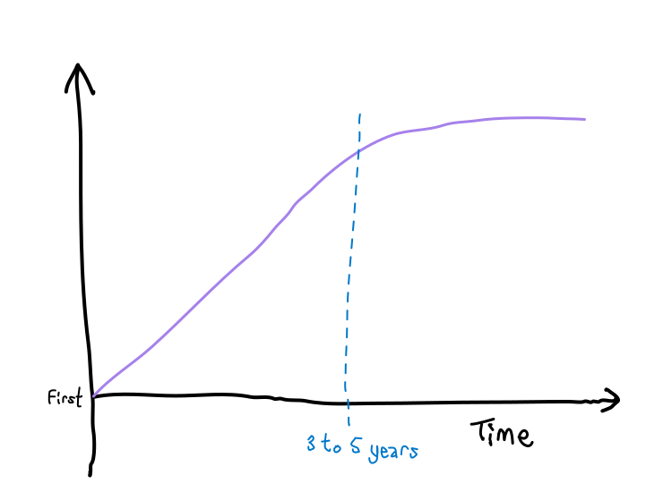
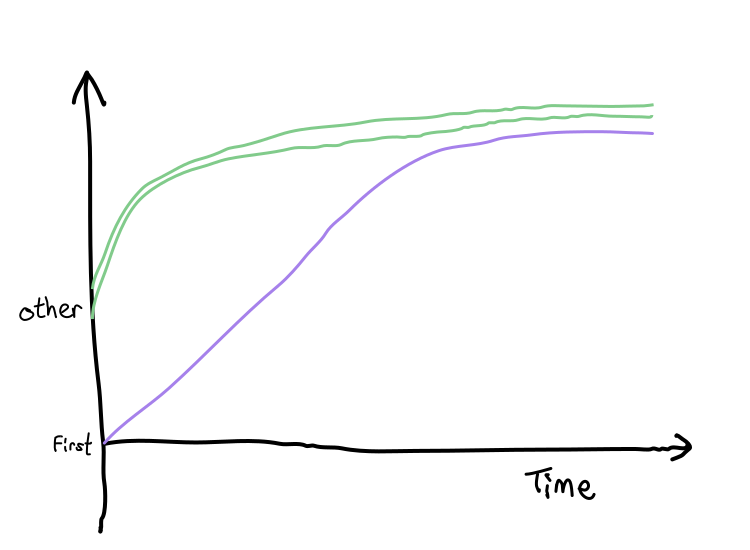
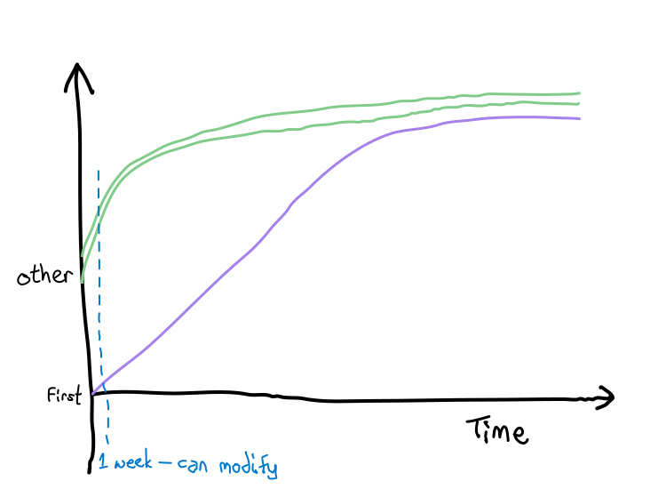
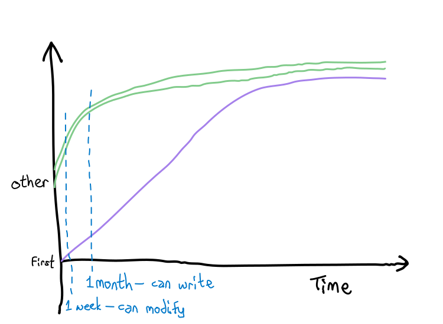
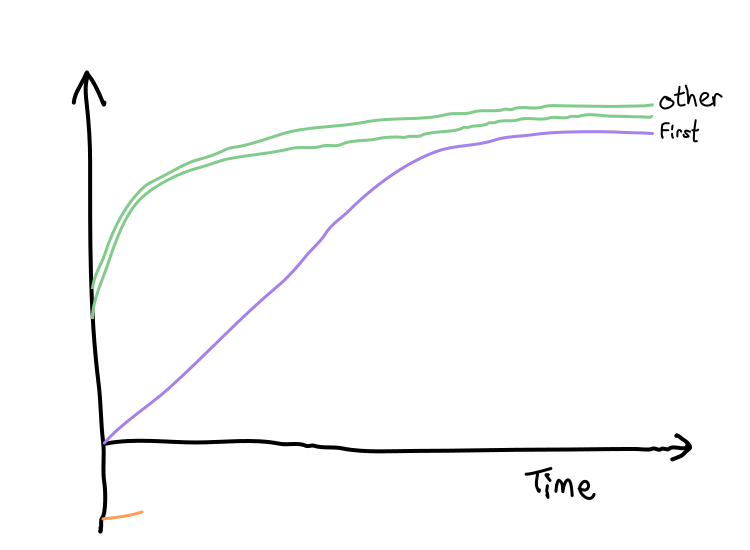
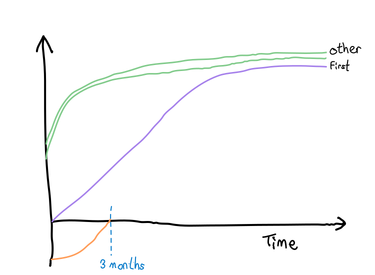
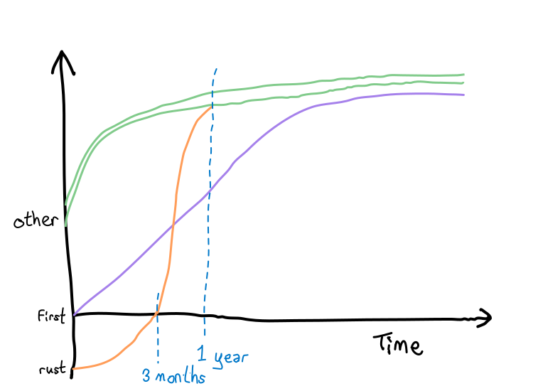
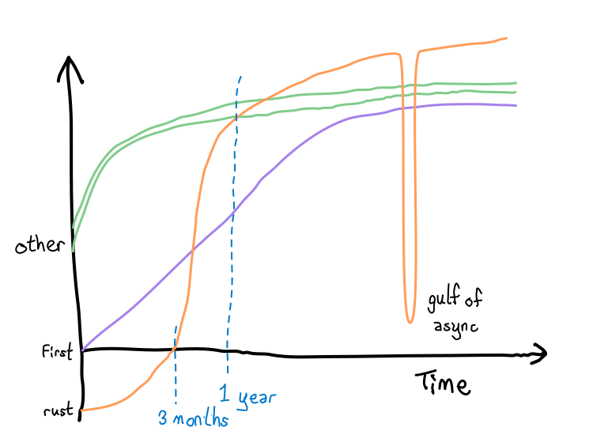

## Learning

<!-- --- -->

### Learning: Skill / Time Graph

<!-- --- -->

### Learning: First Language

<!-- --- -->

### Learning: First Language

<!-- --- -->

### Learning: Other Languages

<!-- --- -->

### Learning: Other Languages

<!-- --- -->

### Learning: Other Languages

<!-- --- -->

### Learning: Rust

<!-- --- -->

### Learning: Rust

<!-- --- -->

### Learning: Rust

<!-- --- -->

### Learning: Rust

<!-- --- -->

### Learning: Rust

#### Notes

2. First, learning.
3. When you first learn to write code, with your first language, you start from zero, and it may take 3 to 5 years to "get good".
4. and when you pick up other languages, you may start at a 4 or 5,
5. and after a week you may be able to modify code without too much effort, and after a month you may be able to write code without referring to documentation.

6. With Rust, it's a bit different.
7. You start here, which is like negative 2, and it may take 3 months to *unlearn what you know*.
8. It can take up to a year to stop avoiding a lifetime,
9. and beyond that it's, mostly smooth sailing.
10. I find that it pushes you towards concepts not necessarily common in other languages, so the ceiling gets raised a little bit.
