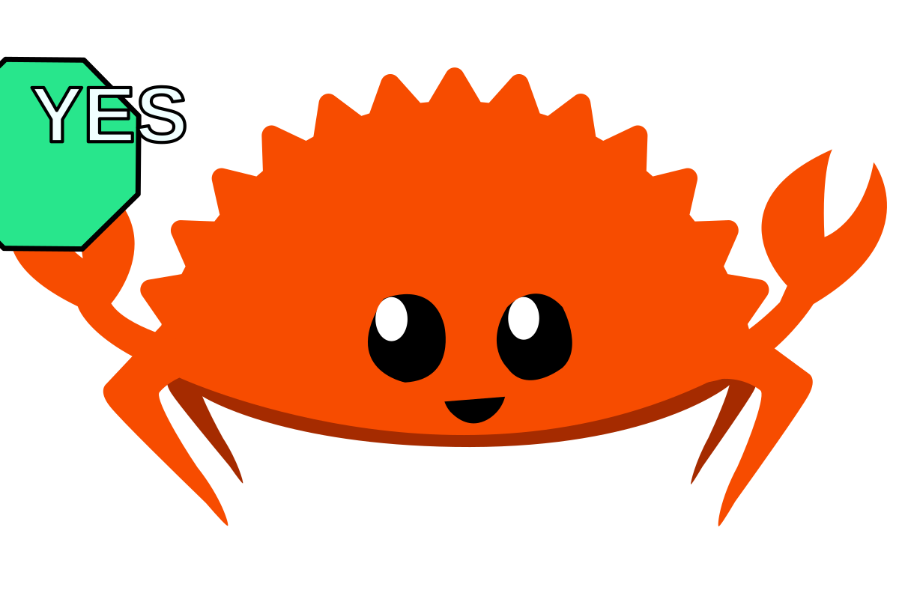
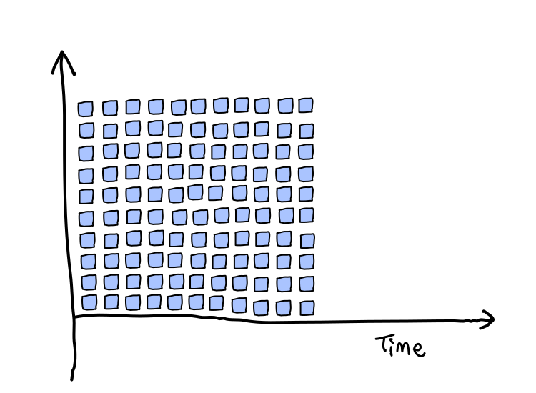
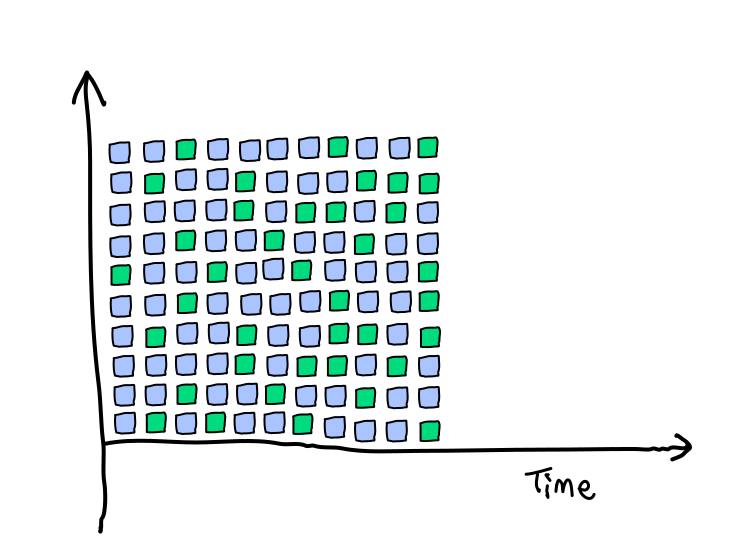
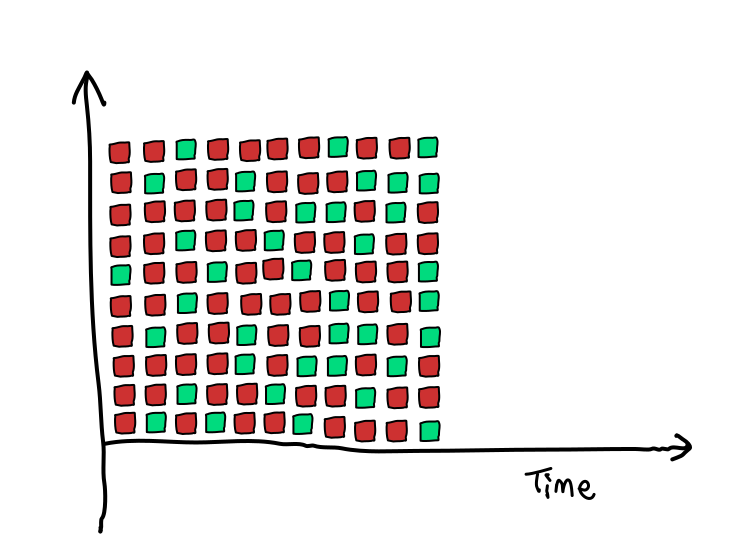
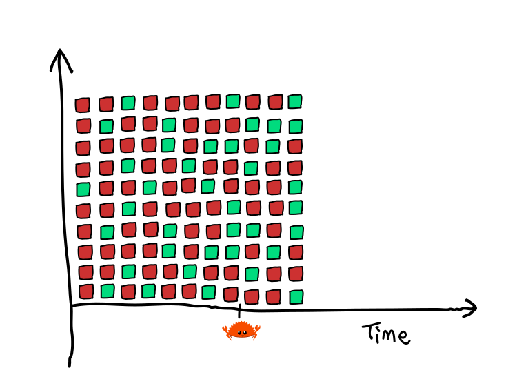
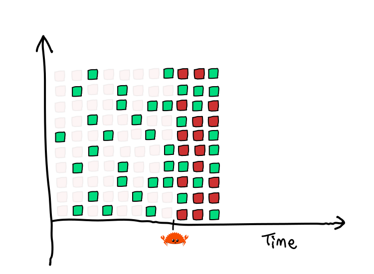
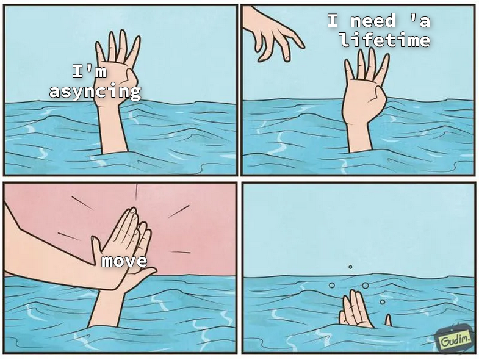

# 🦀 The Development Experience Is Different With Rust

Azriel Hoh

## Learning

<!-- --- -->

### Learning: Skill / Time Graph


<!-- --- -->

### Learning: First Language


<!-- --- -->

### Learning: First Language


<!-- --- -->

### Learning: Other Languages


<!-- --- -->

### Learning: Other Languages


<!-- --- -->

### Learning: Other Languages


<!-- --- -->

### Learning: Rust


<!-- --- -->

### Learning: Rust


<!-- --- -->

### Learning: Rust


<!-- --- -->

### Learning: Rust


<!-- --- -->

### Learning: Rust


## Learning Rust

<!-- --- -->

### Learning Rust

```rust ignore [1-4]
fn main() {
    let x = 0;
    x += 1;
}
```

<!-- --- -->

### Learning Rust

<pre class="terminal">
<b><span style='color:var(--bright-red,#f55)'>error[E0384]</span><span style='color:var(--bright-white,#fff)'>: cannot assign twice to immutable variable `x`</span></b>
 <b><span style='color:var(--bright-cyan,#5ff)'>--&gt; </span></b>src\main.rs:3:5
  <b><span style='color:var(--bright-cyan,#5ff)'>|</span></b>
<b><span style='color:var(--bright-cyan,#5ff)'>2</span></b> <b><span style='color:var(--bright-cyan,#5ff)'>|</span></b>     let x = 0;
  <b><span style='color:var(--bright-cyan,#5ff)'>|</span></b>         <b><span style='color:var(--bright-cyan,#5ff)'>-</span></b> <b><span style='color:var(--bright-cyan,#5ff)'>first assignment to `x`</span></b>
<b><span style='color:var(--bright-cyan,#5ff)'>3</span></b> <b><span style='color:var(--bright-cyan,#5ff)'>|</span></b>     x += 1;
  <b><span style='color:var(--bright-cyan,#5ff)'>|</span></b>     <b><span style='color:var(--bright-red,#f55)'>^^^^^^</span></b> <b><span style='color:var(--bright-red,#f55)'>cannot assign twice to immutable variable</span></b>
  <b><span style='color:var(--bright-cyan,#5ff)'>|</span></b>
<b><span style='color:var(--bright-cyan,#5ff)'>help</span></b>: consider making this binding mutable
  <b><span style='color:var(--bright-cyan,#5ff)'>|</span></b>
<b><span style='color:var(--bright-cyan,#5ff)'>2</span></b> <b><span style='color:var(--bright-cyan,#5ff)'>| </span></b>    let <span style='color:var(--bright-green,#5f5)'>mut </span>x = 0;
  <b><span style='color:var(--bright-cyan,#5ff)'>|</span></b>         <span style='color:var(--bright-green,#5f5)'>+++</span>

<b><span style='color:var(--bright-white,#fff)'>For more information about this error, try `rustc --explain E0384`.</span></b>
<b><span style='color:var(--yellow,#a60)'>warning</span>:</b> `simple` (bin &quot;simple&quot;) generated 2 warnings
<b><span style='color:var(--red,#a00)'>error</span>:</b> could not compile `simple` (bin &quot;simple&quot;) due to 1 previous error; 2 warnings emitted
</pre>

<!-- --- -->

### Learning Rust

```rust ignore [1-4]
fn main() {
    let x = 0;
    x += 1;
}
```


<!-- --- -->

### Learning Rust

```rust ignore [1-4]
fn main() {
    let mut s = "hello ";
    s += "world";
}
```


<!-- --- -->

### Learning Rust

```rust ignore [1-5]
fn main() {
    let mut s = String::from("hello");
    let list = vec![s];
    s += " world";
}
```


<!-- --- -->

### Learning Rust

```rust ignore [1-5]
fn main() {
    let s = String::from("hello");
    let mut list = vec![s];
    list.get_mut(0) += " world";
}
```


<!-- --- -->

### Learning Rust

```rust ignore [1-7]
fn main() {
    let s = String::from("hello");
    let mut list = vec![s];
    if let Some(s) = list.get_mut(0) {
        s += " world";
    }
}
```


<!-- --- -->

### Learning Rust


#### Notes

20. The point is, when you're learning, even for the most basic of things, it can feel like "Rust says no to everything I *know* how to do".

## Keep Going

<blockquote>Be adamant: I will beat this computer.</blockquote>

#### Notes

1. Channel your inner rebel.
2. Now you may be thinking, Rust is introducing complexity where there wasn't any before.
3. and you're right!
4. But it also provides clarity.
5. *(excitedly)* Let me show you, let me show you.

<!-- So let me and try and convince you that the balance of complexifying and simplification used in Rust  -->

<!-- --- -->

### Keep Going: Perspective

<object
    type="image/svg+xml"
    data="software_less_constrained.svg"
    width="700"></object>
<small>[](https://azriel.im/dot_ix/#src=CYSwTgpgxgLiD2A7AXAAgG4THKBDANgFAAWIWuYUxAnsoaqgM7wBmMA7hRHQwyIugIhgPXgwBGuYAH0AjGgDeAX3pjUkmQCZFKteqnSAzDtViN0gCwm95gKzW15gGwOzBgOyve5gBxeJBgCcJqYYQiKhATKyAAz++tHyqMqRqFDwYJCw8eayxsm6jgayVgWpufZlhIjwwBDSiLgAthCMosxsnJBoAEQAPOIAfADKrBxcfQD0QwwAFPitjGlIjDBguPwQwACUPar8gvjCvQODAJIC4VNDewyHx6j9QwBqV9ODt8uZ0DBogKDkqlyaEAMuSAgzaVCgqJGEFgmSlKEJaSVRHOWHQzyQuHSPxY6HBPFI2LoolJVHFfLk6II7GyFGEQhbADmrVEuWk0nMpQA2rkADRIiwAXWxmg5djQvPBArsIuhhnFBhcqClMkMMqVcsFipkmNVlg1uq1dh1OMldkNOONStNBP1TktgWt0Ripry5uKMUteWdclkbp5uVk3uFqnS31gbsq3PDWRg3tsIsIMGIEBa7Rg1AWbVCNTq0jqLFwAFd8DAc3pGMRcAAHerpfAZNCQYCpCAADzWuDQUGLYGYYAAtDX4PwYFhUiwQPh8NIq1J6jUwE0CGhNDEYqlVmB4ABrerz-NLlf4NC2DehZn1QslsttVAAMlIwDqiGSqA7XbQz9fqEKDFjH5RDEec62kBsm1QJlIAgRBQg6cZui3aswIgsA0EYfBcHHSdp1nQ96mIeBMHQ1B103Ss1j3A9q3zIiSLPC8xAOcJgN4UD63gRtSMw7CIC3Kj9znTMFjQYBcCrLZQnuCJKxQzjuIwrCcMonchNWLNuFQcTJNbNxdTQAAqH9YNCXwjJMuD9OkAljOEV9CCAA)</small>

#### Notes

21. Though consider the perspective that, you are so used to having compilers only having constraints that prevent 50% of issues,

<!-- --- -->

### Keep Going: Perspective

<object
    type="image/svg+xml"
    data="software_less_constrained_invalid_focused.svg"
    width="700"></object>
<small>[](https://azriel.im/dot_ix/#src=CYSwTgpgxgLiD2A7AXAAgG4THKBDANgFAAWIWuYUxAnsoaqgM7wBmMA7hRHQwyIugIhgPXgwBGuYAH0AjGgDeAX3pjUkmQCZFKteqnSAzDtViN0gCwm95gKzW15gGwOzBgOyve5gBxeJBgCcJqYYQiKhATKyAAz++tHyqMqRqFDwYJCw8eayxsm6jgayVgWpufZlhIjwwBDSiLgAthCMosxsnJBoAEQAPOIAfADKrBxcfQD0QwwAFPitjGlIjDBguPwQwACUPar8gvjCvQODAJIC4VNDewyHx6j9QwBqV9ODt8uZ0DBogKDkqlyaEAMuSAgzaVCgqJGEFgmSlKEJaSVRHOWHQzyQuHSPxY6HBPFI2LoolJVHFfLk6II7GyFGEQhbADmrVEuWk0nMpQA2rkADRIiwAXWxmg5djQvPBArsIuhhnFBhcqClMkMMqVcsFipkmNVlg1uq1dh1OMldkNOONStNBP1TktgWt0Ripry5uKMUteWdclkbp5uVk3uFqnS31gbsq3PDWRg3tsIsIMGIEBa7Rg1AWbVCNTq0jqLFwAFd8DAc3pGMRcAAHerpfAZNCQYCpCAADzWuDQUGLYGYYAAtDX4PwYFhUiwQPh8NIq1J6jUwE0CGhNDEYqlVmB4ABrerz-NLlf4NC2DehZn1QslsttVAAMlIwDqiGSqA7XbQz9fqEKDFjH5RDEec62kBsm1QJlIAgRBQg6cZui3aswIgsA0EYfBcHHSdp1nQ96mIeBMHQ1B103Ss1j3A9q3zIiSLPC8xAOcJgN4UD63gRtSMw7CIC3Kj9znTMFjQYBcCrLZcJnOdaMXDITzQWIKLUeBixgI5EAPETuFQcTJNbPQ1I0zZwK4yDxHwYt+KM9TNPqdhhBTNdUmM+zZIXRiVLuVjkNrTjuIwrCcMonchNWLNdP01NDO8Dw0AAKh-WDQl8RLkrgtwZAJJLhFfQggA)</small>

#### Notes

25. Software that cannot compile is invalid, and therefore, incorrect.

<!-- --- -->

### Keep Going: Perspective

<object
    type="image/svg+xml"
    data="software_less_constrained_valid_focused.svg"
    width="700"></object>
<small>[](https://azriel.im/dot_ix/#src=CYSwTgpgxgLiD2A7AXAAgG4THKBDANgFAAWIWuYUxAnsoaqgM7wBmMA7hRHQwyIugIhgPXgwBGuYAH0AjGgDeAX3pjUkmQCZFKteqnSAzDtViN0gCwm95gKzW15gGwOzBgOyve5gBxeJBgCcJqYYQiKhATKyAAz++tHyqMqRqFDwYJCw8eayxsm6jgayVgWpufZlhIjwwBDSiLgAthCMosxsnJBoAEQAPOIAfADKrBxcfQD0QwwAFPitjGlIjDBguPwQwACUPar8gvjCvQODAJIC4VNDewyHx6j9QwBqV9ODt8uZ0DBogKDkqlyaEAMuSAgzaVCgqJGEFgmSlKEJaSVRHOWHQzyQuHSPxY6HBPFI2LoolJVHFfLk6II7GyFGEQhbADmrVEuWk0nMpQA2rkADRIiwAXWxmg5djQvPBArsIuhhnFBhcqClMkMMqVcsFipkmNVlg1uq1dh1OMldkNOONStNBP1TktgWt0Ripry5uKMUteWdclkbp5uVk3uFqnS31gbsq3PDWRg3tsIsIMGIEBa7Rg1AWbVCNTq0jqLFwAFd8DAc3pGMRcAAHerpfAZNCQYCpCAADzWuDQUGLYGYYAAtDX4PwYFhUiwQPh8NIq1J6jUwE0CGhNDEYqlVmB4ABrerz-NLlf4NC2DehZn1QslsttVAAMlIwDqiGSqA7XbQz9fqEKDFjH5RDEec62kBsm1QJlIAgRBQg6cZui3aswIgsA0EYfBcHHSdp1nQ96mIeBMHQ1B103Ss1j3A9q3zIiSLPC8xAOcJgN4UD63gRtSMw7CIC3Kj9znTMFjQYBcCrLZQnuCJKxQzjuIwrCcMonchNWLNuFQcTJNbPQpxnOdaMXDITzQWIKLUeBixgI5EAPEStJ01M9Ksmy7IUyDxHwYt+L0azbM2aR2GEFM11SAKPKMhdGMsjE0AAKh-WDQl8RLkrgtwZAJJLhFfQggA)</small>

#### Notes

26. Software that successfully compiles is valid, but not necessarily correct.

<!-- --- -->

### Keep Going: Perspective

<object
    type="image/svg+xml"
    data="software_less_constrained_valid_incorrect_focused.svg"
    width="700"></object>
<small>[](https://azriel.im/dot_ix/#src=CYSwTgpgxgLiD2A7AXAAgG4THKBDANgFAAWIWuYUxAnsoaqgM7wBmMA7hRHQwyIugIhgPXgwBGuYAH0AjGgDeAX3pjUkmQCZFKteqnSAzDtViN0gCwm95gKzW15gGwOzBgOyve5gBxeJBgCcJqYYQiKhATKyAAz++tHyqMqRqFDwYJCw8eayxsm6jgayVgWpufZlhIjwwBDSiLgAthCMosxsnJBoAEQAPOIAfADKrBxcfQD0QwwAFPitjGlIjDBguPwQwACUPar8gvjCvQODAJIC4VNDewyHx6j9QwBqV9ODt8uZ0DBogKDkqlyaEAMuSAgzaVCgqJGEFgmSlKEJaSVRHOWHQzyQuHSPxY6HBPFI2LoolJVHFfLk6II7GyFGEQhbADmrVEuWk0nMpQA2rkADRIiwAXWxmg5djQvPBArsIuhhnFBhcqClMkMMqVcsFipkmNVlg1uq1dh1OMldkNOONStNBP1TktgWt0Ripry5uKMUteWdclkbp5uVk3uFqnS31gbsq3PDWRg3tsIsIMGIEBa7Rg1AWbVCNTq0jqLFwAFd8DAc3pGMRcAAHerpfAZNCQYCpCAADzWuDQUGLYGYYAAtDX4PwYFhUiwQPh8NIq1J6jUwE0CGhNDEYqlVmB4ABrerz-NLlf4NC2DehZn1QslsttVAAMlIwDqiGSqA7XbQz9fqEKDFjH5RDEec62kBsm1QJlIAgRBQg6cZui3aswIgsA0EYfBcHHSdp1nQ96mIeBMHQ1B103Ss1j3A9q3zIiSLPC8xAOcJgN4UD63gRtSMw7CIC3Kj9znTMFjQYBcCrLZQnuCJKxQzjuIwrCcMonchNWLNuFQcTJNbMQWHgXtGC2NAHwMoypL0KcZznWjFwyE80FiCi1HgYsYCORADxErSdNTPTXPczyFMg8R8GLfi9DcjzNmkdhhBTNdUmi4LbIXRiXOhd1UAAKnM4tjICrLSjywyCss7xikqUqLKKpFMRyn9YNCXw0Ea4RXxaoI2qauCgA)</small>

#### Notes

26. Software that successfully compiles is valid, but not necessarily correct.

<!-- --- -->

### Keep Going: Perspective

<object
    type="image/svg+xml"
    data="software_more_constrained_invalid_incorrect_focused.svg"
    width="700"></object>
<small>[](https://azriel.im/dot_ix/#src=CYSwTgpgxgLiD2A7AXAAgG4THKBDANgFAAWIWuYUxAnsoaqgM7wBmMA7hRHQwyIugIhgPXgwBGuYAH0AjGgDeAX3pjUkmQCZFKteqnSAzDtViN0gCwm95gKzW15gGwOzBgOyve5gBxeJBgCcJqYYQiKhATKyAAz++tHyqMqRqFDwYJCw8eayxsm6jgayVgWpufZlhIjwwBDSiLgAthCMosxsnJBoAEQAPOIAfADKrBxcfQD0QwwAFE0ZEGlIjDBguPwQwACUPar8gvjCvQODAJIC4VNDewyHx6j9QwBqV9ODt8uZ0DBogKDkqlyaEAMuSAgzaVCgqJGEFgmSlKEJaSVRHOWHQzyQuHSPxY6HBPFI2LoolJVHFfLk6II7GyFGEBlbADmrVEuWk0nMpQA2rkADRIiwAXWxmg5djQvPBArsIuhhnFBhcqClMkMMqVcsFipkmNVlg1uq1dh1OMldkNOONStNBP1TktgWt0Ripry5uKMUteWdclkbp5uVk3uFqnS31gbsq3PDWRg3tsIsIMGIEBa7Rg1HwrNCNTq0jqLFwAFd8DA2qlGMRcAAHerpfAZNCQYCpCAADzWuDQUGLYGYYAAtDX4PwYFhUiwQPh8NIq1J6jUwE0CGhNDEYpW1vAANb1ef5pcr-BoWwb0LM+qFktltqoABkpGAdUQyVQHa7aCfL9QhQYsZ+UQxHnOtpAbJtUCZSAIEQUIOnGbpK2rUDwLANBGHwXBx0nadZwPepiHgTA0NQddNz0VYwF3fdq3zQjiNPc8xAOcIgN4ED63gRsSIwrCIC3Ki9znTNszQYBcCrLZQnuCIKOQzjuPQzDsIo7chNWLNuFQcTJNbMQWHgXtGC2NB7wMoypL0KcZznWjFwyY80Fici1HgYsYCORB9xErSdNTPTXPczyFIg8R8GLfi9DcjzNmkdhhBTNdUmi4LbIXRiXIxNAACpzOLYyAuhXFcsM-LLO8IIcrygrQlyfJsu-GDauKUoGuEF9muiSo2ufJqgA)</small>

#### Notes

27. If more of the incorrect software, can be classified as invalid, then it follows that when your code successfully compiles, it's more likely to be *correct*.

<!-- --- -->

### Keep Going: Perspective

<object
    type="image/svg+xml"
    data="software_more_constrained_correct_focused.svg"
    width="700"></object>
<small>[](https://azriel.im/dot_ix/#src=CYSwTgpgxgLiD2A7AXAAgG4THKBDANgFAAWIWuYUxAnsoaqgM7wBmMA7hRHQwyIugIhgPXgwBGuYAH0AjGgDeAX3pjUkmQCZFKteqnSAzDtViN0gCwm95gKzW15gGwOzBgOyve5gBxeJBgCcJqYYQiKhATKyAAz++tHyqMqRqFDwYJCw8eayxsm6jgayVgWpufZlhIjwwBDSiLgAthCMosxsnJBoAEQAPOIAfADKrBxcfQD0QwwAFE0ZEGlIjDBguPwQwACUPar8gvjCvQODAJIC4VNDewyHx6j9QwBqV9ODt8uZ0DBogKDkqlyaEAMuSAgzaVCgqJGEFgmSlKEJaSVRHOWHQzyQuHSPxY6HBPFI2LoolJVHFfLk6II7GyFGEBlbADmrVEuWk0nMpQA2rkADRIiwAXWxmg5djQvPBArsIuhhnFBhcqClMkMMqVcsFipkmNVlg1uq1dh1OMldkNOONStNBP1TktgWt0Ripry5uKMUteWdclkbp5uVk3uFqnS31gbsq3PDWRg3tsIsIMGIEBa7Rg1HwrNCNTq0jqLFwAFd8DA2qlGMRcAAHerpfAZNCQYCpCAADzWuDQUGLYGYYAAtDX4PwYFhUiwQPh8NIq1J6jUwE0CGgAOSaGIxNeVtbwADW9Xn+aXK-w69sW53YmZ9ULJbLbVQADJSMA6ohkqgO120G+P6ghQMCw8C9owWxoM+IFgVsk7TrOx6LhkZ7rrE26pPAxYwEciBHpm2ZoMAuBVrBeiYdhmzSA2TbqPgxYQBhWE4fU7DCCm66aNeajkcxc7VnUF5XqEsY-KIYh9H0aAAFTQcW4Gtno851lR8CNmAaBMpAECIKEHTjN0lbVsp1HqUw+C4OOcEznxC7SMQ8CYKZG5CYpe6HjZ+b2Y5gnoWIBzhGJvBKfWqk0Yw5mWa5YAHnhWbcKgREkQpvD3BEilGSFaloOFFkMVFMVzvh8WJamyXQu6qBSf+2mhLkpRVcIH61cUlQNe+NVAA)</small>

#### Notes

28. Hopefully that makes your learning experience better.

<!-- --- -->

### Keep Going: Feedback

<pre class="terminal">
<b><span style='color:var(--bright-red,#f55)'>error[E0384]</span><span style='color:var(--bright-white,#fff)'>: cannot assign twice to immutable variable `x`</span></b>
 <b><span style='color:var(--bright-cyan,#5ff)'>--&gt; </span></b>src\main.rs:3:5
  <b><span style='color:var(--bright-cyan,#5ff)'>|</span></b>
<b><span style='color:var(--bright-cyan,#5ff)'>2</span></b> <b><span style='color:var(--bright-cyan,#5ff)'>|</span></b>     let x = 0;
  <b><span style='color:var(--bright-cyan,#5ff)'>|</span></b>         <b><span style='color:var(--bright-cyan,#5ff)'>-</span></b> <b><span style='color:var(--bright-cyan,#5ff)'>first assignment to `x`</span></b>
<b><span style='color:var(--bright-cyan,#5ff)'>3</span></b> <b><span style='color:var(--bright-cyan,#5ff)'>|</span></b>     x += 1;
  <b><span style='color:var(--bright-cyan,#5ff)'>|</span></b>     <b><span style='color:var(--bright-red,#f55)'>^^^^^^</span></b> <b><span style='color:var(--bright-red,#f55)'>cannot assign twice to immutable variable</span></b>
  <b><span style='color:var(--bright-cyan,#5ff)'>|</span></b>
<b><span style='color:var(--bright-cyan,#5ff)'>help</span></b>: consider making this binding mutable
  <b><span style='color:var(--bright-cyan,#5ff)'>|</span></b>
<b><span style='color:var(--bright-cyan,#5ff)'>2</span></b> <b><span style='color:var(--bright-cyan,#5ff)'>| </span></b>    let <span style='color:var(--bright-green,#5f5)'>mut </span>x = 0;
  <b><span style='color:var(--bright-cyan,#5ff)'>|</span></b>         <span style='color:var(--bright-green,#5f5)'>+++</span>

<b><span style='color:var(--bright-white,#fff)'>For more information about this error, try `rustc --explain E0384`.</span></b>
<b><span style='color:var(--yellow,#a60)'>warning</span>:</b> `simple` (bin &quot;simple&quot;) generated 2 warnings
<b><span style='color:var(--red,#a00)'>error</span>:</b> could not compile `simple` (bin &quot;simple&quot;) due to 1 previous error; 2 warnings emitted
</pre>

#### Notes

29. Let's take a look at the compiler message again.

<!-- --- -->

### Keep Going: Feedback

<pre class="terminal">
<b><span style='color:var(--bright-red,#f55)'>error[E0384]</span>
 <b><span style='color:var(--bright-cyan,#5ff)'>--&gt; </span></b>src\main.rs:3:5
  <b><span style='color:var(--bright-cyan,#5ff)'>|</span></b>
<b><span style='color:var(--bright-cyan,#5ff)'>3</span></b> <b><span style='color:var(--bright-cyan,#5ff)'>|</span></b>     x += 1;
  <b><span style='color:var(--bright-cyan,#5ff)'>|</span></b>     <b><span style='color:var(--bright-red,#f55)'>^^^^^^</span></b>

<b><span style='color:var(--bright-white,#fff)'>For more information about this error, try `rustc --explain E0384`.</span></b>
<b><span style='color:var(--yellow,#a60)'>warning</span>:</b> `simple` (bin &quot;simple&quot;) generated 2 warnings
<b><span style='color:var(--red,#a00)'>error</span>:</b> could not compile `simple` (bin &quot;simple&quot;) due to 1 previous error; 2 warnings emitted
</pre>

#### Notes

30. Normally I would expect a compiler message to tell me, "azriel, here's where you're wrong!" and that's it!

<!-- --- -->

### Keep Going: Feedback

<pre class="terminal">
<b><span style='color:var(--bright-red,#f55)'>error[E0384]</span><span style='color:var(--bright-white,#fff)'>: cannot assign twice to immutable variable `x`</span></b>
 <b><span style='color:var(--bright-cyan,#5ff)'>--&gt; </span></b>src\main.rs:3:5
  <b><span style='color:var(--bright-cyan,#5ff)'>|</span></b>
<b><span style='color:var(--bright-cyan,#5ff)'>2</span></b> <b><span style='color:var(--bright-cyan,#5ff)'>|</span></b>     let x = 0;
  <b><span style='color:var(--bright-cyan,#5ff)'>|</span></b>         <b><span style='color:var(--bright-cyan,#5ff)'>-</span></b> <b><span style='color:var(--bright-cyan,#5ff)'>first assignment to `x`</span></b>
<b><span style='color:var(--bright-cyan,#5ff)'>3</span></b> <b><span style='color:var(--bright-cyan,#5ff)'>|</span></b>     x += 1;
  <b><span style='color:var(--bright-cyan,#5ff)'>|</span></b>     <b><span style='color:var(--bright-red,#f55)'>^^^^^^</span></b> <b><span style='color:var(--bright-red,#f55)'>cannot assign twice to immutable variable</span></b>
  <b><span style='color:var(--bright-cyan,#5ff)'>|</span></b>
<b><span style='color:var(--bright-cyan,#5ff)'>help</span></b>: consider making this binding mutable
  <b><span style='color:var(--bright-cyan,#5ff)'>|</span></b>
<b><span style='color:var(--bright-cyan,#5ff)'>2</span></b> <b><span style='color:var(--bright-cyan,#5ff)'>| </span></b>    let <span style='color:var(--bright-green,#5f5)'>mut </span>x = 0;
  <b><span style='color:var(--bright-cyan,#5ff)'>|</span></b>         <span style='color:var(--bright-green,#5f5)'>+++</span>

<b><span style='color:var(--bright-white,#fff)'>For more information about this error, try `rustc --explain E0384`.</span></b>
<b><span style='color:var(--yellow,#a60)'>warning</span>:</b> `simple` (bin &quot;simple&quot;) generated 2 warnings
<b><span style='color:var(--red,#a00)'>error</span>:</b> could not compile `simple` (bin &quot;simple&quot;) due to 1 previous error; 2 warnings emitted
</pre>

#### Notes

29. But when you look at the message from the Rust compiler, it says,

<!-- --- -->

### Keep Going: Feedback

<pre class="terminal">
<span style="opacity: 0.3;"><b><span style='color:var(--bright-red,#f55)'>error[E0384]</span><span style='color:var(--bright-white,#fff)'>: cannot assign twice to immutable variable `x`</span></b></span>
<span style="opacity: 1.0;"> <b><span style='color:var(--bright-cyan,#5ff)'>--&gt; </span></b>src\main.rs:3:5</span>
<span style="opacity: 0.3;">  <b><span style='color:var(--bright-cyan,#5ff)'>|</span></b></span>
<span style="opacity: 0.3;"><b><span style='color:var(--bright-cyan,#5ff)'>2</span></b> <b><span style='color:var(--bright-cyan,#5ff)'>|</span></b>     let x = 0;</span>
<span style="opacity: 0.3;">  <b><span style='color:var(--bright-cyan,#5ff)'>|</span></b>         <b><span style='color:var(--bright-cyan,#5ff)'>-</span></b> <b><span style='color:var(--bright-cyan,#5ff)'>first assignment to `x`</span></b></span>
<span style="opacity: 1.0;"><b><span style='color:var(--bright-cyan,#5ff)'>3</span></b> <b><span style='color:var(--bright-cyan,#5ff)'>|</span></b>     x += 1;</span>
<span style="opacity: 1.0;">  <b><span style='color:var(--bright-cyan,#5ff)'>|</span></b></span>     <b><span style="opacity: 1.0;"><span style='color:var(--bright-red,#f55)'>^^^^^^</span></span></b> <b><span style="opacity: 0.3;"><span style='color:var(--bright-red,#f55)'>cannot assign twice to immutable variable</span></span></b>
<span style="opacity: 1.0;">  <b><span style='color:var(--bright-cyan,#5ff)'>|</span></b></span>
<span style="opacity: 0.3;"><b><span style='color:var(--bright-cyan,#5ff)'>help</span></b>: consider making this binding mutable</span>
<span style="opacity: 0.3;">  <b><span style='color:var(--bright-cyan,#5ff)'>|</span></b></span>
<span style="opacity: 0.3;"><b><span style='color:var(--bright-cyan,#5ff)'>2</span></b> <b><span style='color:var(--bright-cyan,#5ff)'>| </span></b>    let <span style='color:var(--bright-green,#5f5)'>mut </span>x = 0;</span>
<span style="opacity: 0.3;">  <b><span style='color:var(--bright-cyan,#5ff)'>|</span></b>         <span style='color:var(--bright-green,#5f5)'>+++</span></span>
<span style="opacity: 0.3;"></span>
<span style="opacity: 0.3;"><b><span style='color:var(--bright-white,#fff)'>For more information about this error, try `rustc --explain E0384`.</span></b></span>
<span style="opacity: 0.3;"><b><span style='color:var(--yellow,#a60)'>warning</span>:</b> `simple` (bin &quot;simple&quot;) generated 2 warnings</span>
<span style="opacity: 0.3;"><b><span style='color:var(--red,#a00)'>error</span>:</b> could not compile `simple` (bin &quot;simple&quot;) due to 1 previous error; 2 warnings emitted</span>
</pre>

#### Notes

31. "azriel, here's where you're wrong!", and, and, "this is why, and here is how to fix it."

<!-- --- -->

### Keep Going: Feedback

<pre class="terminal">
<span style="opacity: 1.0;"><b><span style='color:var(--bright-red,#f55)'>error[E0384]</span><span style='color:var(--bright-white,#fff)'>: cannot assign twice to immutable variable `x`</span></b></span>
<span style="opacity: 0.3;"> <b><span style='color:var(--bright-cyan,#5ff)'>--&gt; </span></b>src\main.rs:3:5</span>
<span style="opacity: 0.3;">  <b><span style='color:var(--bright-cyan,#5ff)'>|</span></b></span>
<span style="opacity: 0.3;"><b><span style='color:var(--bright-cyan,#5ff)'>2</span></b> <b><span style='color:var(--bright-cyan,#5ff)'>|</span></b>     let x = 0;</span>
<span style="opacity: 0.3;">  <b><span style='color:var(--bright-cyan,#5ff)'>|</span></b>         <b><span style='color:var(--bright-cyan,#5ff)'>-</span></b> <b><span style='color:var(--bright-cyan,#5ff)'>first assignment to `x`</span></b></span>
<span style="opacity: 0.3;"><b><span style='color:var(--bright-cyan,#5ff)'>3</span></b> <b><span style='color:var(--bright-cyan,#5ff)'>|</span></b>     x += 1;</span>
<span style="opacity: 0.3;">  <b><span style='color:var(--bright-cyan,#5ff)'>|</span></b></span>     <b><span style="opacity: 0.3;"><span style='color:var(--bright-red,#f55)'>^^^^^^</span></span></b> <b><span style="opacity: 1.0;"><span style='color:var(--bright-red,#f55)'>cannot assign twice to immutable variable</span></span></b>
<span style="opacity: 0.3;">  <b><span style='color:var(--bright-cyan,#5ff)'>|</span></b></span>
<span style="opacity: 0.3;"><b><span style='color:var(--bright-cyan,#5ff)'>help</span></b>: consider making this binding mutable</span>
<span style="opacity: 0.3;">  <b><span style='color:var(--bright-cyan,#5ff)'>|</span></b></span>
<span style="opacity: 0.3;"><b><span style='color:var(--bright-cyan,#5ff)'>2</span></b> <b><span style='color:var(--bright-cyan,#5ff)'>| </span></b>    let <span style='color:var(--bright-green,#5f5)'>mut </span>x = 0;</span>
<span style="opacity: 0.3;">  <b><span style='color:var(--bright-cyan,#5ff)'>|</span></b>         <span style='color:var(--bright-green,#5f5)'>+++</span></span>
<span style="opacity: 0.3;"></span>
<span style="opacity: 1.0;"><b><span style='color:var(--bright-white,#fff)'>For more information about this error, try `rustc --explain E0384`.</span></b></span>
<span style="opacity: 0.3;"><b><span style='color:var(--yellow,#a60)'>warning</span>:</b> `simple` (bin &quot;simple&quot;) generated 2 warnings</span>
<span style="opacity: 0.3;"><b><span style='color:var(--red,#a00)'>error</span>:</b> could not compile `simple` (bin &quot;simple&quot;) due to 1 previous error; 2 warnings emitted</span>
</pre>

<!-- --- -->

### Keep Going: Feedback

<pre class="terminal">
<span style="opacity: 0.3;"><b><span style='color:var(--bright-red,#f55)'>error[E0384]</span><span style='color:var(--bright-white,#fff)'>: cannot assign twice to immutable variable `x`</span></b></span>
<span style="opacity: 0.3;"> <b><span style='color:var(--bright-cyan,#5ff)'>--&gt; </span></b>src\main.rs:3:5</span>
<span style="opacity: 1.0;">  <b><span style='color:var(--bright-cyan,#5ff)'>|</span></b></span>
<span style="opacity: 1.0;"><b><span style='color:var(--bright-cyan,#5ff)'>2</span></b> <b><span style='color:var(--bright-cyan,#5ff)'>|</span></b>     let x = 0;</span>
<span style="opacity: 1.0;">  <b><span style='color:var(--bright-cyan,#5ff)'>|</span></b>         <b><span style='color:var(--bright-cyan,#5ff)'>-</span></b> <b><span style='color:var(--bright-cyan,#5ff)'>first assignment to `x`</span></b></span>
<span style="opacity: 0.3;"><b><span style='color:var(--bright-cyan,#5ff)'>3</span></b> <b><span style='color:var(--bright-cyan,#5ff)'>|</span></b>     x += 1;</span>
<span style="opacity: 0.3;">  <b><span style='color:var(--bright-cyan,#5ff)'>|</span></b></span>     <b><span style="opacity: 0.3;"><span style='color:var(--bright-red,#f55)'>^^^^^^</span></span></b> <b><span style="opacity: 1.0;"><span style='color:var(--bright-red,#f55)'>cannot assign twice to immutable variable</span></span></b>
<span style="opacity: 0.3;">  <b><span style='color:var(--bright-cyan,#5ff)'>|</span></b></span>
<span style="opacity: 1.0;"><b><span style='color:var(--bright-cyan,#5ff)'>help</span></b>: consider making this binding mutable</span>
<span style="opacity: 1.0;">  <b><span style='color:var(--bright-cyan,#5ff)'>|</span></b></span>
<span style="opacity: 1.0;"><b><span style='color:var(--bright-cyan,#5ff)'>2</span></b> <b><span style='color:var(--bright-cyan,#5ff)'>| </span></b>    let <span style='color:var(--bright-green,#5f5)'>mut </span>x = 0;</span>
<span style="opacity: 1.0;">  <b><span style='color:var(--bright-cyan,#5ff)'>|</span></b>         <span style='color:var(--bright-green,#5f5)'>+++</span></span>
<span style="opacity: 1.0;"></span>
<span style="opacity: 0.3;"><b><span style='color:var(--bright-white,#fff)'>For more information about this error, try `rustc --explain E0384`.</span></b></span>
<span style="opacity: 0.3;"><b><span style='color:var(--yellow,#a60)'>warning</span>:</b> `simple` (bin &quot;simple&quot;) generated 2 warnings</span>
<span style="opacity: 0.3;"><b><span style='color:var(--red,#a00)'>error</span>:</b> could not compile `simple` (bin &quot;simple&quot;) due to 1 previous error; 2 warnings emitted</span>
</pre>

#### Notes

29. Now you may be thinking, Rust is introducing complexity where there wasn't any before.
30. and you're right!

<!-- 22. that when a compiler enforces a whole lot more constraints, your instinct is, the compiler is wrong, because that's not how compilers work.
23. But I promise you, it's a shortcut to discovering the issues you would have to fix anyway. -->

## Clarity

#### Notes

31. But it also provides clarity.
32. *(excitedly)* Let me show you, let me show you.

<!-- --- -->

### Clarity: Equality

### 🥤 == 🥤

#### Notes

1. This is how you know you're a software developer.
2. *(take out two canned drinks)*
3. Does this (drink), equal, this? *(smile)*
4. In other words, what does equality mean?

<!-- --- -->

### Clarity: Equality

| Language               | ☕<br/>Java | 🌐 JS | 🐍 Python | 🦀 Rust |
|------------------------|-----------|-------|-----------|----------|
| 123 == 123             |     🟢    |   🟢  |     🟢    |    ❔   |
| "abc" == "ab" + "c"    | sometimes |   🟢  |     🟢    |    ❔   |
| [1] == [1]             |     🟣    |   🟣  |     🟢    |    ❔   |
| Data(123) == Data(123) |     🟣    |   🟣  |     🟣    |    ❔   |

#### Notes

1. The meaning of the double equals operator varies with the type and the language.
2. I'm going to give you another one to learn.
3. Rust has chosen this definition:

<!-- --- -->

### Clarity: Equality


#### Notes

1. Equals equals, equals, equals.

<!-- --- -->

### Clarity: Equality

| Language               | ☕<br/>Java | 🌐 JS | 🐍 Python | 🦀 Rust |
|------------------------|-----------|-------|-----------|----------|
| 123 == 123             |     🟢    |   🟢  |     🟢    |    🟢   |
| "abc" == "ab" + "c"    | sometimes |   🟢  |     🟢    |    🟢   |
| [1] == [1]             |     🟣    |   🟣  |     🟢    |    🟢   |
| Data(123) == Data(123) |     🟣    |   🟣  |     🟣    |    🟢   |

#### Notes

1. In Rust, the double equals operator, means value equality,
2. which is what you would've thought it means, *before* you were clever.


## Clarity: Errors

#### Notes

1. Errors. The way errors have been represented has changed over time.

<!-- --- -->

### Clarity: Errors &ndash; Sentinel values

```java [1-15]
int fileSize = readFileSize("file.txt");
if (fileSize == -1) { /* error path */ }
else                { /* success path */ }

Metadata metadata = getMetadata("file.txt");
if (metadata != null) { /* success path */ }
else                  { /* error path */ }

Error error = process("file.txt");
if (error != null) { /* error path */ }
else               { /* success path */ }
```


#### Notes

1. With sentinel values, which is using a special value to mean "error",
2. the caller has to remember to check for the error value, then diverge the code paths for success and failure.

<!-- --- -->

### Clarity: Errors &ndash; Exceptions

```java [1-8]
try {
    download("https://example.com/file1.txt");
    /* success path 1 */
}
catch (UnknownHostException e) { /* failure path 1 */ }
catch (IOException e)          { /* failure path 2 */ }
/* success path 2 */
```

#### Notes

1. Then came exceptions, which separated the success and failure code paths with compiler support.

<!-- --- -->

### Clarity: Errors &ndash; Exceptions

```java [1-9]
try {
    // which line throws the exception? can't tell 🤷
    download("https://example.com/file1.txt");
    download("https://example.com/file2.txt");
}
catch (UnknownHostException e) { /* failure path 1 */ }
catch (IOException e)          { /* failure path 2 */ }
```

#### Notes

1. However! `try/catch` blocks can be ambiguous as to which line throws the exception,
2. and just from the code, there's no visible marker for which method actually throws exceptions.

<!-- --- -->

### Clarity: Errors &ndash; Exceptions

```java [1-7]
try { download("https://example.com/file1.txt"); }
catch (UnknownHostException e) { /* failure path 1 */ }
catch (IOException e)          { /* failure path 2 */ }

try { download("https://example.com/file2.txt"); }
catch (UnknownHostException e) { /* failure path 3 */ }
catch (IOException e)          { /* failure path 4 */ }
```

#### Notes

1. To be unambiguous, you'd have to have a separate try block for each line that could fail.

<!-- --- -->

### Clarity: Errors &ndash; Exceptions

```java [1-7]
try {
    // which of these throws the exception? if at all?
    // can't tell 😞
    method1();
    method2();
}
catch (Exception e) {}
```

<!-- --- -->

### Clarity: Errors &ndash; Exceptions

```java [1-5]
public class DownloadException extends Exception {
    public DownloadException(String message) { /* .. */ }
    public DownloadException(String message, Throwable cause) { /* .. */ }
    public DownloadException(Throwable cause) { /* .. */ }
}
```

#### Notes

1. Also, when defining exception classes, there is friction.
2. Conventionally one should define a file for every exception, and multiple constructors within each.

<!-- --- -->

### Clarity: Errors &ndash; Progression

**Sentinel values**

1. ✅ Indicate error to caller

**Exceptions**

2. ✅ Compile time feedback for success/failure paths
3. ☑️ Unambiguous code paths

**Can we have**

4. ❔ Low effort to define error types
5. ❔ Visibility where errors are propagated from


#### Notes

1. So exceptions have made error handling a bit better, but can we further refine this part of programming?

<!-- --- -->

### Clarity: Errors &ndash; Rust



<!-- --- -->

### Clarity: Errors &ndash; Rust

<!--
    1. Copied HTML generated from the following snippet.
    2. Changed `<code>` to `<span>`.
    3. Added CSS styles to the span manually.

    ```rust ignore [1-7]
    fn download(url: &Url) -> Result<(), DownloadError> { /* .. */ }

    // One variant per kind of error
    enum DownloadError {
        DnsLookupFail { url: Url },
        ConnBroke     { url: Url, n_bytes: usize },
    }
    ```
-->

<pre class="code-wrapper"><span data-line-numbers="1-7" class="rust ignore hljs language-rust has-highlights" data-highlighted="yes" style="
    white-space: pre;
    border-radius: 4px;
    font-size: 1.2em;
    line-height: 1.3;
    display: block;
    overflow-x: auto;
    padding: 1em;
    background: #f0f0f0;
"><table class="hljs-ln"><tbody><tr class="highlight-line"><td class="hljs-ln-line hljs-ln-numbers" data-line-number="1"><div class="hljs-ln-n" data-line-number="1"></div></td><td class="hljs-ln-line hljs-ln-code" data-line-number="1"><span class="hljs-keyword">fn</span> <span class="hljs-title function_">download</span>(url: &amp;Url) <span class="hljs-punctuation">-&gt;</span> <span class="hljs-type">Result</span>&lt;(), DownloadError&gt; { <span class="hljs-comment">/* .. */</span> }</td></tr><tr class="highlight-line"><td class="hljs-ln-line hljs-ln-numbers" data-line-number="2"><div class="hljs-ln-n" data-line-number="2"></div></td><td class="hljs-ln-line hljs-ln-code" data-line-number="2"> </td></tr><tr class="highlight-line"><td class="hljs-ln-line hljs-ln-numbers" data-line-number="3"><div class="hljs-ln-n" data-line-number="3"></div></td><td class="hljs-ln-line hljs-ln-code" data-line-number="3"><span class="hljs-comment">// One variant per kind of error</span></td></tr><tr class="highlight-line"><td class="hljs-ln-line hljs-ln-numbers" data-line-number="4"><div class="hljs-ln-n" data-line-number="4"></div></td><td class="hljs-ln-line hljs-ln-code" data-line-number="4"><span class="hljs-keyword">enum</span> <span class="hljs-title class_">DownloadError</span> {</td></tr><tr class="highlight-line"><td class="hljs-ln-line hljs-ln-numbers" data-line-number="5"><div class="hljs-ln-n" data-line-number="5"></div></td><td class="hljs-ln-line hljs-ln-code" data-line-number="5">    DnsLookupFail { url: Url },</td></tr><tr class="highlight-line"><td class="hljs-ln-line hljs-ln-numbers" data-line-number="6"><div class="hljs-ln-n" data-line-number="6"></div></td><td class="hljs-ln-line hljs-ln-code" data-line-number="6">    ConnBroke     { url: Url, n_bytes: <span class="hljs-type">usize</span> },</td></tr><tr class="highlight-line"><td class="hljs-ln-line hljs-ln-numbers" data-line-number="7"><div class="hljs-ln-n" data-line-number="7"></div></td><td class="hljs-ln-line hljs-ln-code" data-line-number="7">}</td></tr></tbody></table></span></pre>

#### Notes

1. Rust's approach to error handling is to provide a `Result` type, where you pass in your error type.
2. Different kinds of errors can be written as enum variants, which is far less boilerplate than a file per error variant.

<!-- --- -->

### Clarity: Errors &ndash; Rust

<pre class="code-wrapper"><span data-line-numbers="1-7" class="rust ignore hljs language-rust has-highlights" data-highlighted="yes" style="
    white-space: pre;
    border-radius: 4px;
    font-size: 1.2em;
    line-height: 1.3;
    display: block;
    overflow-x: auto;
    padding: 1em;
    background: #f0f0f0;
"><table class="hljs-ln"><tbody><tr class="highlight-line"><td class="hljs-ln-line hljs-ln-numbers" data-line-number="1"><div class="hljs-ln-n" data-line-number="1"></div></td><td class="hljs-ln-line hljs-ln-code" data-line-number="1"><span class="hljs-keyword">fn</span> <span class="hljs-title function_">download</span>(url: &amp;Url) <span class="hljs-punctuation">-&gt;</span> <span class="focus_highlight"><span class="hljs-type">Result</span>&lt;(), DownloadError&gt;</span> { <span class="hljs-comment">/* .. */</span> }</td></tr><tr class="highlight-line"><td class="hljs-ln-line hljs-ln-numbers" data-line-number="2"><div class="hljs-ln-n" data-line-number="2"></div></td><td class="hljs-ln-line hljs-ln-code" data-line-number="2"> </td></tr><tr class="highlight-line"><td class="hljs-ln-line hljs-ln-numbers" data-line-number="3"><div class="hljs-ln-n" data-line-number="3"></div></td><td class="hljs-ln-line hljs-ln-code" data-line-number="3"><span class="hljs-comment">// One variant per kind of error</span></td></tr><tr class="highlight-line"><td class="hljs-ln-line hljs-ln-numbers" data-line-number="4"><div class="hljs-ln-n" data-line-number="4"></div></td><td class="hljs-ln-line hljs-ln-code" data-line-number="4"><span class="hljs-keyword">enum</span> <span class="hljs-title class_">DownloadError</span> {</td></tr><tr class="highlight-line"><td class="hljs-ln-line hljs-ln-numbers" data-line-number="5"><div class="hljs-ln-n" data-line-number="5"></div></td><td class="hljs-ln-line hljs-ln-code" data-line-number="5">    DnsLookupFail { url: Url },</td></tr><tr class="highlight-line"><td class="hljs-ln-line hljs-ln-numbers" data-line-number="6"><div class="hljs-ln-n" data-line-number="6"></div></td><td class="hljs-ln-line hljs-ln-code" data-line-number="6">    ConnBroke     { url: Url, n_bytes: <span class="hljs-type">usize</span> },</td></tr><tr class="highlight-line"><td class="hljs-ln-line hljs-ln-numbers" data-line-number="7"><div class="hljs-ln-n" data-line-number="7"></div></td><td class="hljs-ln-line hljs-ln-code" data-line-number="7">}</td></tr></tbody></table></span></pre>

<!-- --- -->

### Clarity: Errors &ndash; Rust

<pre class="code-wrapper"><span data-line-numbers="1-7" class="rust ignore hljs language-rust has-highlights" data-highlighted="yes" style="
    white-space: pre;
    border-radius: 4px;
    font-size: 1.2em;
    line-height: 1.3;
    display: block;
    overflow-x: auto;
    padding: 1em;
    background: #f0f0f0;
"><table class="hljs-ln"><tbody><tr class="highlight-line"><td class="hljs-ln-line hljs-ln-numbers" data-line-number="1"><div class="hljs-ln-n" data-line-number="1"></div></td><td class="hljs-ln-line hljs-ln-code" data-line-number="1"><span class="hljs-keyword">fn</span> <span class="hljs-title function_">download</span>(url: &amp;Url) <span class="hljs-punctuation">-&gt;</span> <span class="hljs-type">Result</span>&lt;(), <span class="focus_highlight">DownloadError</span>&gt; { <span class="hljs-comment">/* .. */</span> }</td></tr><tr class="highlight-line"><td class="hljs-ln-line hljs-ln-numbers" data-line-number="2"><div class="hljs-ln-n" data-line-number="2"></div></td><td class="hljs-ln-line hljs-ln-code" data-line-number="2"> </td></tr><tr class="highlight-line"><td class="hljs-ln-line hljs-ln-numbers" data-line-number="3"><div class="hljs-ln-n" data-line-number="3"></div></td><td class="hljs-ln-line hljs-ln-code" data-line-number="3"><span class="hljs-comment">// One variant per kind of error</span></td></tr><tr class="highlight-line"><td class="hljs-ln-line hljs-ln-numbers" data-line-number="4"><div class="hljs-ln-n" data-line-number="4"></div></td><td class="hljs-ln-line hljs-ln-code" data-line-number="4"><span class="hljs-keyword">enum</span> <span class="hljs-title class_">DownloadError</span> {</td></tr><tr class="highlight-line"><td class="hljs-ln-line hljs-ln-numbers" data-line-number="5"><div class="hljs-ln-n" data-line-number="5"></div></td><td class="hljs-ln-line hljs-ln-code" data-line-number="5">    DnsLookupFail { url: Url },</td></tr><tr class="highlight-line"><td class="hljs-ln-line hljs-ln-numbers" data-line-number="6"><div class="hljs-ln-n" data-line-number="6"></div></td><td class="hljs-ln-line hljs-ln-code" data-line-number="6">    ConnBroke     { url: Url, n_bytes: <span class="hljs-type">usize</span> },</td></tr><tr class="highlight-line"><td class="hljs-ln-line hljs-ln-numbers" data-line-number="7"><div class="hljs-ln-n" data-line-number="7"></div></td><td class="hljs-ln-line hljs-ln-code" data-line-number="7">}</td></tr></tbody></table></span></pre>

<!-- --- -->

### Clarity: Errors &ndash; Rust

<pre class="code-wrapper"><span data-line-numbers="1-7" class="rust ignore hljs language-rust has-highlights" data-highlighted="yes" style="
    white-space: pre;
    border-radius: 4px;
    font-size: 1.2em;
    line-height: 1.3;
    display: block;
    overflow-x: auto;
    padding: 1em;
    background: #f0f0f0;
"><table class="hljs-ln"><tbody><tr class="highlight-line"><td class="hljs-ln-line hljs-ln-numbers" data-line-number="1"><div class="hljs-ln-n" data-line-number="1"></div></td><td class="hljs-ln-line hljs-ln-code" data-line-number="1"><span class="hljs-keyword">fn</span> <span class="hljs-title function_">download</span>(url: &amp;Url) <span class="hljs-punctuation">-&gt;</span> <span class="hljs-type">Result</span>&lt;(), DownloadError&gt; { <span class="hljs-comment">/* .. */</span> }</td></tr><tr class="highlight-line"><td class="hljs-ln-line hljs-ln-numbers" data-line-number="2"><div class="hljs-ln-n" data-line-number="2"></div></td><td class="hljs-ln-line hljs-ln-code" data-line-number="2"> </td></tr><tr class="highlight-line"><td class="hljs-ln-line hljs-ln-numbers" data-line-number="3"><div class="hljs-ln-n" data-line-number="3"></div></td><td class="hljs-ln-line hljs-ln-code" data-line-number="3"><span class="hljs-comment">// One variant per kind of error</span></td></tr><tr class="highlight-line"><td class="hljs-ln-line hljs-ln-numbers" data-line-number="4"><div class="hljs-ln-n" data-line-number="4"></div></td><td class="hljs-ln-line hljs-ln-code" data-line-number="4"><span class="hljs-keyword">enum</span> <span class="hljs-title class_">DownloadError</span> {</td></tr><tr class="highlight-line"><td class="hljs-ln-line hljs-ln-numbers" data-line-number="5"><div class="hljs-ln-n" data-line-number="5"></div></td><td class="hljs-ln-line hljs-ln-code" data-line-number="5">    <span class="focus_highlight">DnsLookupFail { url: Url },</span></td></tr><tr class="highlight-line"><td class="hljs-ln-line hljs-ln-numbers" data-line-number="6"><div class="hljs-ln-n" data-line-number="6"></div></td><td class="hljs-ln-line hljs-ln-code" data-line-number="6">    ConnBroke     { url: Url, n_bytes: <span class="hljs-type">usize</span> },</td></tr><tr class="highlight-line"><td class="hljs-ln-line hljs-ln-numbers" data-line-number="7"><div class="hljs-ln-n" data-line-number="7"></div></td><td class="hljs-ln-line hljs-ln-code" data-line-number="7">}</td></tr></tbody></table></span></pre>

<!-- --- -->

### Clarity: Errors &ndash; Unambiguous

```rust ignore [1-11]
match download("file1.txt") {
    Ok(())                    => {},
    Err(DnsLookupFail { .. }) => { /* error path 1 */ },
    Err(ConnBroke     { .. }) => { /* error path 2 */ },
}

match download("file2.txt") {
    Ok(())                    => {},
    Err(DnsLookupFail { .. }) => { /* error path 3 */ },
    Err(ConnBroke     { .. }) => { /* error path 4 */ },
}
```

#### Notes

1. On usage, control flow is unambiguous by default.

<!-- --- -->

### Clarity: Errors &ndash; Commonized Handling

```rust ignore [1-8]
let result = download("file1.txt")
    .and_then(|_| download("file2.txt"));

match result {
    Ok(())                    => {},
    Err(DnsLookupFail { .. }) => { /* error path 1 */ },
    Err(ConnBroke     { .. }) => { /* error path 2 */ },
}
```

<!-- --- -->

### Clarity: Errors &ndash; Visible Failures

```rust ignore [1-7]
never_fail();
might_fail()?;
//          ^
//          '-- question mark indicates possible error

download("file1.txt")?;
download("file2.txt")?;
```

## Expressive

#### Notes

56. Rust is expressive,
57. and by expressive I mean, you can take an idea, and write it in code, without much effort.
58. And the converse as well, you can read the code, and grasp the idea, without much effort.

<!-- --- -->

### Expressive: Example 1

```rust ignore [1-3]
let duration_1 = Duration::from_mins(3)
    + Duration::from_secs(15)
    + Duration::from_secs(47);
```

```rust ignore [4:1-3]
let duration_2 = 3.minutes()
    + 15.seconds()
    + 47.seconds();
```

#### Notes

57. Which of these two do you read more naturally?
58. I'll tell you why: it's because when you buy coffee, the barista doesn't say, "That's dollars five, cents fifty".
59. No they say, "That's five dollars fifty cents".
60. What you *can* do in Rust, is implement behaviour over existing types,
61. and create API like the second snippet.
62. (pause) Why is this useful?

<!-- --- -->

### Expressive: Example 2

```rust ignore [1-3]
let result =
    fs::write(render(parse("markdown", parse_opts), render_opts), path)?;
//  4         3      2     1           2            3             4
```

```rust ignore [1-3]
let parsed = parse("markdown", parse_opts);
let rendered = render(parsed, render_opts);
let result = fs::write(rendered, path)?;
```

```rust ignore [1-4]
let result = "markdown"  // 1
    .parse(parse_opts)   // 2
    .render(render_opts) // 3
    .write(path)?;       // 4
```

#### Notes

1. Let's say you're writing code to render markdown to a file.
2. If you inline all the function calls, to understand it, you have to read from the middle out.
3. You could break them over multiple lines, which looks a bit better.
4. With Rust traits, you can write code like the third snippet, even when the type is defined externally.
5. (pause) There's something about that empty space and alignment that makes it more readable, right?
6. Many libraries in Rust provide aesthetic APIs because *it's possible*, so it makes learning to use them much easier.


## Expressive: Cloning

<!-- --- -->

### Expressive: Cloning

```js fit [1-2]
let data = { a: 1 };
let other = deserialize(serialize(data));
```

* 🔴 Idea to Code: "clone is spelt ser..de.."
* 🟡 Code to Idea: "ser..de.. makes a clone"
* 🔴 Not performant

<!-- --- -->

### Expressive: Cloning

```js fit [1-2]
let data = { a: 1 };
let other = structuredClone(data);
```

```cs fit [1-3]
class Data: ICloneable { /* .. */ }
Data data = new Data(123);
Data other = data.Clone();
```

* 🟢 Idea to Code: "clone is spelt `*Clone()`"
* 🟡 Code to Idea: "`*Clone()` might clone, or fail"
* 🟡 Surprising: `*Clone()` *kind of* clones.

<!-- --- -->

### Expressive: Cloning

```rust ignore fit [1-5]
#[derive(Clone)]
struct Data(String);

let data = Data("hello".into());
let other = data.clone();
```

* 🟢 Idea to Code: "clone is spelt `clone()`"
* 🟢 Code to Idea: "`clone()` means clone"
* 🟢 Removed the surprises.

<!-- --- -->

### Clarity and Expressiveness

| Item            | Rust's bias                               |
| --------------- | ----------------------------------------- |
| 🧠 Semantics    | Favour one expected meaning (unambiguity) |
| 🔁 Control Flow | Make visible divergence and convergence   |
| 🎭 Expression   | Call things by name, not by how it works  |

## Tooling

#### Notes

1. Rust has a really nice tooling ecosystem.

<!-- --- -->

### Tooling: Standard

* 🐚 `rustup`: Rust version manager
* 🧹 `rustfmt`: Code formatter
* 📝 `rustdoc`: Documentation generator
* 📦 `cargo`: Package manager
* 📎 `clippy`: Linter

#### Notes

1. It ships with good standard tools, and there is *one* for each purpose.
2. You know, it's really nice when I want to code, that I can just... code,
3. and not have to install and learn the new tool of the day.

<!-- --- -->

### Tooling: Package Manager (cargo)

<ul>
<li class="fragment">🎨 Good UX</li>
<li class="fragment">🗄️ Workspace support (multi-package repo)

```toml
[workspace]
members = ["crate/*"]
```

</li>
<li class="fragment">📲 Easily override dependencies for testing

```toml
[patch.crates-io]
uuid = { path = "../uuid" }
```

</li>
<ul>

#### Notes

1. `cargo` is Rust's package manager, and it has really nice UX.
2. When you tell it "run my application", it downloads dependencies, compiles your project, and runs your application.
3. And it's cancellable *and* idempotent as well, so you can stop it, and re-run the command, (pause) and it will *pick up, where it left off*.
4. It has support for workspaces, so you can manage multiple packages in a single repository.
5. and it's easy to override dependencies, so you can test your code with a patched version of the dependency.
6. That is, *so many* things that need to be done, *can* be done, in a supported way.

<!-- --- -->

### Tooling: Linter (📎clippy)

```diff
 let x = 5;
-let in_range = x >= 3 && x < 8;
+let in_range = (3..8).contains(&x);
```

```diff
-let _ = 'a'..'z';  // 'a' to 'x'
+let _ = 'a'..='z'; // 'a' to 'z'
```

#### Notes

1. Rust comes with a linter, called `clippy`.
2. Clippy teaches you how to write code in the idiomatic Rust way, which can help to make code easier to read, and in some cases, how to avoid bugs.
3. So it improves your code, *and!* it doesn't even use AI.
4. It really nice to be taught how to be eloquent with Rust, at a digestable pace.
5. So in pull requests, more of the discussion can be focused on what we're writing, than on our ability to speak the language.

<!-- --- -->

### Tooling: Others

Many tools by the community

* **Compliance:** (cargo-) 🛡️ audit, 🙅 deny, ❓ about

* **Workflow:** `watchexec`, hot reloading, static site generators

* **Modernized:** `bat`, `btm`, `fd-find`, `lsd`, `rg`, `sd`, `zoxide`

* many more &ndash; [lib.rs/keywords/cargo-subcommand](https://lib.rs/keywords/cargo-subcommand)

<div class="fragment">

```bash fit
cargo install $tool_name
```

</div>

#### Notes

1. There are *many*, many more tools written by the community.
2. They are generally easy to set up and integrate into your build pipeline.
3. What's really nice about all this tooling is, when you run `cargo install $tool_name`, it just works... and *I'm using Windows*.
4. You don't get an obscure error message, which, plus some keywords, becomes the unique identifier to a stack overflow question, whose solution doesn't work on your computer.
5. So you spend far less time fiddling with tools, and more time building.

<!-- should this be a summary slide for everything / upgrades? -->

## Safety

#### Notes

1. Safety. Not the kind you're thinking of, but psychological safety.

<!-- --- -->

### Safety: Promises

<div class="fragment">

```toml
 [dependencies]
 library = "0.?.?"
```

</div>

<div class="fragment">

```bash
 # use the latest versions of everything
 cargo upgrade --incompatible allow --recursive
```

</div>

#### Notes

1. Here's an interesting... observation: most of my project dependencies have a version of `0.something.something`.
2. i.e. the major version is always `0`.
3. and this reveals an interesting trait about the Rust community: people are so concerned about making a promise that they cannot keep, most would never publish a crate as `1.0`.
4. Like, "aah, I might change the API in the next 20 years! So I'm not going to promise stability now."
5. In this ecosystem, keeping dependencies up to date is not a burdensome chore.
6. Periodically, I run `cargo upgrade --incompatible allow --recursive`, and, *again*, (pause) it, just, works.
7. Stress levels and anxiety for maintenance go down, psychological safety goes up.
8. So here is a thank you to the many of you, for keeping the promises that you did not make.

<!-- --- -->

### Safety: Community


#### Notes

1. Finally, the experience beyond the code.
2. When you interact with the community, like ask a question in the users forum, no matter how simple or complex it is, someone's going to answer, and they answer with clarity.
3. So not only do you receive the answer, you actually *feel* helped.
4. There's no sentiment of, "Don't ask stupid questions! or, your question must be this good, before we answer you". That doesn't exist.


## Closing Remarks

<!-- --- -->

### Closing Remarks: Tech Progress



<!-- --- -->

### Closing Remarks: Tech Progress



<!-- --- -->

### Closing Remarks: Tech Progress



<!-- --- -->

### Closing Remarks: Tech Progress



<!-- --- -->

### Closing Remarks: Tech Progress



#### Notes

1. This talk isn't intended to diminish the value of any other language.
2. There are *decades* of learnings from so many languages.
3. Not just what worked, but also what didn't work.
4. Rust has the late starter advantage, where it has the privileged position of taking the patterns that work for today's applications, and not having to support the patterns that don't.
5. Without the experimentation and lessons from all these other languages, there would *be* no Rust.
6. So it is simply a progression of technology, not a pedestal to stand on.

<!-- --- -->

### Closing Remarks: Imagine

<!-- --- -->

### Closing Remarks: Imagine 1

```java [1-8]
☕: Exception in thread "main" java.lang.NullPointerException
#️⃣: System.NullReferenceException: Object reference not set to an instance of an object.
🐍: AttributeError: 'NoneType' object has no attribute 'some_attribute'
🌐: TypeError: Cannot read properties of undefined (reading 'property_name')
💎: NoMethodError: undefined method `method_name' for nil:NilClass
🦫: panic: runtime error: invalid memory address or nil pointer dereference
➕: Segmentation fault (core dumped)
🦀: thread 'main' panicked at 'called `Option::unwrap()` on a `None` value'
```


<!-- --- -->

### Closing Remarks: Imagine 2

```java [1-8]
☕: new Data(123) == new Data(123)  // false
#️⃣: new Data(123) == new Data(123)  // False
🐍:     Data(123) == Data(123)      // False
🌐: new Data(123) == new Data(123)  // false
💎: Data.new(123) == Data.new(123)  // false
🦫: Data {v: 123} == Data {v: 123}  // ✅ true
➕:       { 123 } == { 123 }        // ✅ true / compile error
🦀:     Data(123) == Data(123)      // ✅ true / compile error
```


<!-- --- -->

### Closing Remarks: Imagine 3

```java [1-8]
☕: mvn versions:use-latest-versions
#️⃣: dotnet outdated --upgrade
🐍: pip-review --auto
🌐: pnpm update --latest -r
💎: bundle update
🦫: go get -u ./...
➕: conan install . --update
🦀: cargo upgrade
```


<!-- --- -->

### Closing Remarks: Imagine 4



## Try Rust


#### Notes

1. Imagine never seeing another null pointer exception ever again.
2. and installing tools, and they... *install*.
3. Imagine asking for help, and *being helped*.
4. (pause). With Rust, and you don't have to imagine, that's the reality.
5. If you haven't tried Rust yet, give it a go, and enjoy the experience.
6. Peace.

## Thank You


<small>🌐: https://azriel.im/rust_dx/slides.html</small><br />
<small>🐙: https://github.com/azriel91/rust_dx</small>
